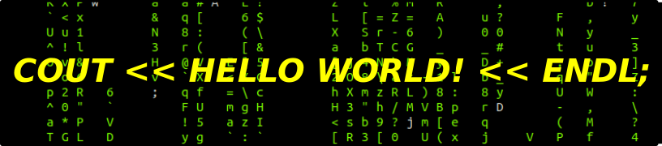

Hello there! my name's Carlos Caminero. I’m a passionate about Development in Robotics Software, Linux System Administration and Ethical Hacking.

### Skills
+ **Advanced Level**: `C++, C, Python, GNU/Linux, ROS/ROS2`
+ **Intermediate Level**: `Assembly, Kali Linux, HTML/CSS/Javascript, Java`

### Personal Websites
* **Mobile Robotics**: https://carlos2caminero.wixsite.com/mobilerobotics
* **Service Robotics**: https://github.com/Carlosalpha1/robotica_servicio/wiki
* **TFG 2021 Weblog**: https://roboticslaburjc.github.io/2021-tfg-carlos-caminero/

### How to reach me
- carlos2caminero@gmail.com

